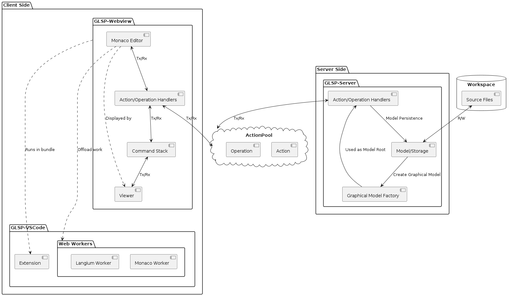

# language-diagrams

Repository of Visual Studio Code extension for graphical editor with textual features.

Part of Thesis: "Editable Diagrams with Embedded Textual Notation for Domain Specific Languages".

## Prerequisites

- [Yarn](https://yarnpkg.com/getting-started/install)
- [NVM](https://github.com/nvm-sh/nvm#installing-and-updating)

After cloning the repository run:

```shell
nvm use
yarn install
```

To build the packages, run:

```shell
npx gulp build
```

## Contents

### [Documentation](./docs/development/)

To access the modeling files, you need [PlantUML extension](https://plantuml.com/) and [Graphviz](https://graphviz.org/download/). The models are used as a development aid.

Open the model view with (Alt + D).

### [VSCode Configuration](.vscode)

Holds run & debug configuration for VSCode.

### [GLSP Server](./glsp-server/)

Back-end which reads and writes from/to source files.

### [GLSP Extension](./glsp-vscode/)

VS Code extension responsible for starting the glsp-server and registering the webview as a custom editor.

### [GLSP Webview](./glsp-webview/)

Integration of the diagram as webview.

### [Langium](./langium/)

Langium server, which enables Monaco editor to use LSP features.

### [Workspace](./workspace/)

The source files.

## Testing

Each package can be tested individually with running:
```shell
yarn test
```
in the package root.

Alternatively, to test all of the packages at once run:
```shell
npx gulp test
```

## Architecture


